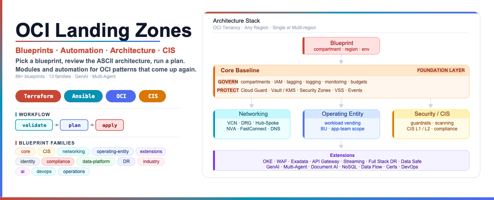

# OCI Landing Zones For Oracle Cloud Infrastructure

Author: Leandro Michelino | ACE | leandro.michelino@oracle.com

This repo is a practical **Oracle Cloud Infrastructure (OCI) landing zones**
toolkit: Terraform modules, ready-to-use OCI blueprints, local Ansible
automation, and plain-text architecture notes for the cloud patterns that come
up again and again.

If you are looking for **OCI Terraform blueprints**, **Oracle Cloud landing zone
examples**, **OCI networking architectures**, **OCI security guardrails**,
**GenAI landing zones**, or a clean way to run Terraform with Ansible, you are
in the right place.

The goal is simple: make the first 10 minutes useful. You should be able to land here,
understand what is available, pick a blueprint, review the ASCII architecture, run a plan,
and know what needs a proper production review.

It is a personal engineering project, not an official Oracle product. Treat it as a strong
accelerator that still deserves the usual production checks: security review,
input validation, tenancy-specific decisions, and an approved plan/apply flow.

## Search-Friendly Summary

This GitHub repository contains deployable Oracle Cloud Infrastructure landing
zone patterns for Terraform and Ansible. It covers OCI Core governance, CIS,
networking, identity, operating entities, OKE, Functions, API Gateway, WAF,
OpenSearch, Autonomous Database, MySQL HeatWave, Redis, Secure Desktops,
security posture automation, disaster recovery, DevOps, and AI/GenAI patterns
such as OCI Generative AI, RAG agents, embeddings, guardrails, fine-tuning, and
multi-agent orchestration.

## Start Here

If you are new here, do not try to read everything in order. Pick the path that matches
what you are doing, then follow the links. This README helps you choose; the blueprint
folders are where you review and run the deployment.

| I Want To... | Start With |
|---|---|
| Find the best deployment folder quickly | [Choose A Deployment](#choose-a-deployment) |
| Walk through the operator flow | [Customer Flow](#customer-flow) |
| Download only one deployment instead of the whole repo | [Use One Blueprint Only](docs/DEPLOYMENT-GUIDE.md#using-a-single-blueprint) |
| Add only an extension to an existing tenancy | [Use Extensions Only](#use-extensions-only-or-with-a-base) |
| Compare the big families before choosing | [Deployment Categories](#deployment-categories) |
| See every blueprint with direct links | [Deployment Menu](#deployment-menu) |
| Build a complete landing zone from several pieces | [Build A Full Landing Zone](#build-a-full-landing-zone) |
| Understand how every blueprint is structured | [Every Blueprint Is End-To-End](#every-blueprint-is-end-to-end) |
| Review BYOL and license-model support | [BYOL And License Model Matrix](docs/BYOL-LICENSING-MATRIX.md) |
| Make the repo easier to find in Google, Bing, and GitHub search | [Search Discoverability](docs/SEARCH-DISCOVERABILITY.md) |
| Validate the repo before trusting a change | [Keep The Repo Clean](#keep-the-repo-clean) |

## Customer Flow

The normal path is intentionally short: choose the deployment, review the local architecture,
fill local inputs, then let Terraform show you the real diff.

```text
choose blueprint
  |
  v
read local README.md
  |
  v
review architecture/README.md
  |
  v
copy terraform.tfvars.example to ignored terraform.tfvars
  |
  v
plan, review, approve, apply
```

| Step | Action | Where |
|---|---|
| 1 | Choose the deployment that matches the outcome. | [Choose A Deployment](#choose-a-deployment) |
| 2 | Open the local blueprint guide. | `blueprints/<family>/<deployment>/README.md` |
| 3 | Review the detailed ASCII component and traffic-flow diagram. | `blueprints/<family>/<deployment>/architecture/README.md` |
| 4 | Copy the example tfvars and fill in real tenancy values. | `terraform.tfvars.example` to ignored `terraform.tfvars` |
| 5 | Run a plan from the deployment folder. | local `terraform` or optional `ansible/plan.yml` |
| 6 | Apply only after review and approval. | guarded `ansible/apply.yml` or reviewed Terraform apply |

For demos, discovery, and workshops, sparse-checkout keeps things focused: pull only the
blueprint you need and ignore the rest until it matters.

## Choose A Deployment

Start with the outcome, then open the linked folder. Each folder has its own README,
architecture, Terraform files, example tfvars, and local Ansible runners.

| Situation | Best Starting Point | Why |
|---|---|---|
| I need the landing-zone baseline first | [Core Landing Zone](blueprints/core/) | Creates the shared compartments, IAM, governance, logging, security, and operations layer. |
| I need a fast VCN example | [Standalone Three-Tier VCN Defaults](blueprints/networking/standalone-three-tier-vcn-defaults/) | Simple web/app/db network with opinionated defaults. |
| I need custom networking | [Standalone Three-Tier VCN Custom](blueprints/networking/standalone-three-tier-vcn-custom/) | Lets you control CIDRs, gateways, route tables, subnets, and security lists. |
| I need enterprise routing | [Hub-Spoke DRG And Three-Tier VCNs](blueprints/networking/hub-spoke-with-drg-and-three-tier-vcns/) | Central hub, DRG, and spoke VCNs for shared connectivity. |
| I need private service access only | [Standalone Private Endpoint Only](blueprints/networking/standalone-private-endpoint-only/) | Keeps traffic private with service gateway and private endpoint patterns. |
| I need regulated posture | [CIS Level 1](blueprints/cis/level1/) or [CIS Level 2](blueprints/cis/level2/) | Uses the core landing zone with CIS-specific posture. |
| I need app-team onboarding | [Workload Vending](blueprints/operating-entity/workload-vending/) | Creates a workload compartment boundary with scoped IAM. |
| I need cost control | [Cost Optimization](blueprints/operations/cost-optimization/) | Adds cost tags, budgets, notifications, Optimizer profiles, and FinOps hand-offs. |
| I need Kubernetes | [OKE Extension](blueprints/extensions/oke/) | Adds an OKE cluster and optional node pool to supplied network IDs. |
| I need containers without Kubernetes | [Container Instances](blueprints/extensions/container-instances/) | Runs approved container images with private VNIC, NSGs, optional pull secrets, and no OKE control plane. |
| I need serverless functions | [Oracle Functions](blueprints/extensions/functions/) | Runs approved function images with private application subnets, optional API Gateway routes, Events triggers, and IAM hand-offs. |
| I need private GenAI | [OCI Generative AI Private Landing Zone](blueprints/ai/genai-private/) | Adds a private GenAI endpoint, optional archive bucket, and IAM policy shell. |
| I need a GenAI API front door | [GenAI Multi-Model Gateway](blueprints/ai/genai-gateway/) | Adds API Gateway routing, usage plans, quotas, audit bucket, log group, and IAM hand-offs. |
| I need RAG agents | [AI Agents RAG Landing Zone](blueprints/ai/agents/) | Adds a GenAI Agent, knowledge base, Object Storage data source, ingestion job, endpoint, and IAM hand-offs. |
| I need RAG/vector search | [OpenSearch Search And Vector Platform](blueprints/data-platform/opensearch/) plus [Embedding Pipeline](blueprints/ai/embedding-pipeline/) | Adds managed OpenSearch and a chunk/embed/index ingestion path. |
| I need agent orchestration | [Multi-Agent Orchestration](blueprints/ai/multi-agent/) | Adds orchestrator and specialist agents, Streaming task hand-off, tool registry, and session audit. |
| I need CI/CD | [OCI DevOps Pipeline](blueprints/devops/oci-devops-pipeline/) | Adds DevOps project, repository, build pipeline, deploy pipeline, and notifications. |
| I need analytics or integration services | [Oracle Analytics Cloud](blueprints/extensions/oac/) or [Oracle Integration Cloud](blueprints/extensions/oic/) | Adds OAC or OIC service foundations with private connectivity options. |
| I need a private data platform | [Private Data Platform](blueprints/data-platform/private-data-platform/) | Builds private VCN, Vault/KMS, Object Storage private endpoint, and Streaming. |
| I need Autonomous Database | [Autonomous Database](blueprints/data-platform/autonomous-database/) | Adds private ATP/ADW with optional KMS, NSG, private endpoint, and backup controls. |
| I need APEX on Autonomous Database | [Oracle APEX On Autonomous Database](blueprints/data-platform/apex-adw/) | Adds private APEX/ORDS ingress, optional Vault secret hand-off, and ADB URL outputs. |
| I need PostgreSQL | [PostgreSQL Landing Zone](blueprints/data-platform/postgresql/) | Adds a private managed PostgreSQL DB system with NSGs, backup policy hooks, and secure credential inputs. |
| I need MySQL analytics | [MySQL HeatWave](blueprints/data-platform/mysql-heatwave/) | Adds private MySQL DB System, optional HeatWave cluster, lakehouse bucket, backup, and IAM controls. |
| I need private cache | [Redis Cache](blueprints/extensions/redis-cache/) | Adds private OCI Cache with Redis, endpoint outputs, alarm hooks, Vault hand-off, and IAM controls. |
| I need managed desktops | [Secure Desktops](blueprints/industry/secure-desktops/) | Adds OCI Secure Desktops pool wiring with image, session, device, network, BYOL, and IAM controls. |
| I need disaster recovery | [Full Stack DR](blueprints/disaster-recovery/fsdr/) | Creates FSDR protection groups, log buckets, and an optional DR plan. |

## Deployment Categories

Use this when you know the family, but not the exact blueprint yet.

| Category | Start Here | Then Look At |
|---|---|---|
| Foundation and compliance | [Core Landing Zone](blueprints/core/) | [Foundation And Compliance](#foundation-and-compliance) |
| Networking | [Hub-Spoke DRG And Three-Tier VCNs](blueprints/networking/hub-spoke-with-drg-and-three-tier-vcns/) | [Networking Deployments](#networking-deployments) |
| Identity and entity onboarding | [Workload Vending](blueprints/operating-entity/workload-vending/) | [Identity And Operating Entity Deployments](#identity-and-operating-entity-deployments) |
| Operations | [Cost Optimization](blueprints/operations/cost-optimization/) | [Operations Deployments](#operations-deployments) |
| Service extensions | [OKE](blueprints/extensions/oke/) | [Extension Deployments](#extension-deployments) |
| AI and DevOps | [GenAI Multi-Model Gateway](blueprints/ai/genai-gateway/) | [AI And DevOps Deployments](#ai-and-devops-deployments) |
| Data, DR, and industry | [Private Data Platform](blueprints/data-platform/private-data-platform/) | [Data, DR, And Industry Deployments](#data-dr-and-industry-deployments) |

## Deployment Menu

Each link below goes directly to the deployment folder.

```text
open folder -> read README.md -> review architecture/README.md -> fill tfvars -> plan
```

### Foundation And Compliance

| Deployment | Use It When |
|---|---|
| [Core Landing Zone](blueprints/core/) | You want the shared OCI foundation: compartments, IAM, tags, logging, Cloud Guard, Vault/KMS, Security Zones, VSS, budgets, events, and monitoring. |
| [CIS Level 1](blueprints/cis/level1/) | You want the core foundation with CIS Level 1-oriented defaults and review posture. |
| [CIS Level 2](blueprints/cis/level2/) | You want a stricter CIS-oriented baseline with stronger evidence and guardrail expectations. |
| [SCCA Cloud Native](blueprints/compliance/scca-cloud-native/) | You need core governance, firewall-centered hub-spoke networking, and OS management for SCCA-style environments. |
| [Zero Trust](blueprints/compliance/zero-trust/) | You need core governance plus a three-tier VCN protected by Zero Trust Packet Routing. |
| [Healthcare PCI Compliance](blueprints/compliance/healthcare-pci/) | You need regulated workload guardrails, budget alerts, and optional Data Safe target registration. |
| [Security Posture Automation](blueprints/compliance/security-posture/) | You need Cloud Guard target wiring, Vulnerability Scanning, event-driven response hooks, report buckets, alarms, and IAM. |

### Networking Deployments

| Deployment | Use It When |
|---|---|
| [Standalone Three-Tier VCN Defaults](blueprints/networking/standalone-three-tier-vcn-defaults/) | You want a clean web/app/db VCN with default gateways and route behavior. |
| [Standalone Three-Tier VCN Custom](blueprints/networking/standalone-three-tier-vcn-custom/) | You need to control CIDRs, subnets, route tables, gateways, and security lists. |
| [Standalone Private Endpoint Only](blueprints/networking/standalone-private-endpoint-only/) | You want private-only service access without an Internet Gateway. |
| [Standalone Three-Tier VCN ZPR](blueprints/networking/standalone-three-tier-vcn-zpr/) | You want a standalone web/app/db VCN with Zero Trust Packet Routing policies. |
| [Externally Managed VCNs](blueprints/networking/externally-managed-vcns/) | You already have VCNs/subnets/DRGs and want a clean output contract for brownfield resources. |
| [Hub-Spoke DRG And Three-Tier VCNs](blueprints/networking/hub-spoke-with-drg-and-three-tier-vcns/) | You need a central hub VCN, DRG, and spoke VCNs for enterprise routing. |
| [Hub-Spoke Dual Region DR](blueprints/networking/hub-spoke-with-dual-region-dr/) | You need matching hub-spoke foundations in primary and secondary regions. |
| [Hub-Spoke Bastion Jump Host](blueprints/networking/hub-spoke-with-hub-vcn-bastion-jump-host/) | You need managed private admin access through OCI Bastion. |
| [Hub-Spoke FastConnect VC](blueprints/networking/hub-spoke-with-hub-vcn-fastconnect-vc/) | You need private on-premises or provider connectivity through FastConnect. |
| [Hub-Spoke IPSec VPN](blueprints/networking/hub-spoke-with-hub-vcn-ipsec-vpn/) | You need encrypted VPN connectivity to on-premises networks. |
| [Hub-Spoke Network Appliance](blueprints/networking/hub-spoke-with-hub-vcn-net-appliance/) | You need custom appliance route targets inside the hub network. |
| [Hub-Spoke OCI Network Firewall](blueprints/networking/hub-spoke-with-hub-vcn-net-firewall/) | You need centralized firewall inspection in the hub VCN. |
| [Hub-Spoke Multicloud Interconnect](blueprints/networking/hub-spoke-with-multicloud-interconnect/) | You need FastConnect plus IPSec paths toward another cloud or remote network. |
| [Hub-Spoke Private DNS Split Horizon](blueprints/networking/hub-spoke-with-private-dns-split-horizon/) | You need private DNS zones and resolver attachments across hub and spokes. |
| [Hub-Spoke Transit Routing NVA HA](blueprints/networking/hub-spoke-with-transit-routing-nva-ha/) | You need highly available network virtual appliances for transit routing. |
| [Hub-Spoke ZPR Micro-Segmentation](blueprints/networking/hub-spoke-with-zpr-micro-segmentation/) | You need ZPR policies layered on a hub-spoke network. |
| [Multi-Tenancy Shared Services](blueprints/networking/multi-tenancy-shared-services/) | You need shared services and private DNS across multiple tenant/workload spokes. |
| [Regional Prod Nonprod Hubs](blueprints/networking/regional-prod-nonprod-hubs/) | You need separate prod and nonprod hub-spoke networks in one region. |
| [Network Load Balancer](blueprints/networking/network-load-balancer/) | You need Layer 4 TCP/UDP load balancing with backend sets, health checks, and listener hand-offs. |

### Identity And Operating Entity Deployments

| Deployment | Use It When |
|---|---|
| [CIS Basic Identity](blueprints/identity/cis-basic/) | You need baseline IAM groups, dynamic groups, and policies. |
| [New Identity Domain](blueprints/identity/new-identity-domain/) | You need one OCI IAM identity domain with optional replica regions. |
| [Custom Identity Domains](blueprints/identity/custom-identity-domain/) | You need multiple identity domains from a structured input map. |
| [Single Operating Entity](blueprints/operating-entity/) | You need one business unit or operating entity compartment tree with scoped IAM. |
| [Multi Operating Entities](blueprints/operating-entity/multi-operating-entities/) | You need several operating entity boundaries from one deployment. |
| [Workload Vending](blueprints/operating-entity/workload-vending/) | You need repeatable app or workload onboarding with compartments and scoped policies. |

### Operations Deployments

| Deployment | Use It When |
|---|---|
| [Cost Optimization](blueprints/operations/cost-optimization/) | You need cost-tracking tags, tag defaults, budgets, alert recipients, FinOps notifications, optional Optimizer profiles, and a clean finance/platform hand-off. |

### Extension Deployments

| Deployment | Use It When |
|---|---|
| [API Gateway](blueprints/extensions/apigw/) | You need managed API exposure and route deployment on top of an existing network. |
| [Container Instances](blueprints/extensions/container-instances/) | You need serverless container runtime with private VNIC, NSGs, optional pull secrets, and no OKE control plane. |
| [Exadata](blueprints/extensions/exadata/) | You need OCI Cloud Exadata Infrastructure capacity. |
| [OKE](blueprints/extensions/oke/) | You need Kubernetes cluster and node pool resources attached to supplied VCN/subnets. |
| [OKE Service Mesh](blueprints/extensions/oke-service-mesh/) | You need service mesh add-on management and optional APM tracing for an existing OKE cluster. |
| [Oracle Functions](blueprints/extensions/functions/) | You need serverless functions from approved images with optional API Gateway and Events wiring. |
| [Event-Driven Application Platform](blueprints/extensions/event-driven-platform/) | You need Events, Streaming, Service Connector, Notifications, and archive storage for async apps or AI automation. |
| [Redis Cache](blueprints/extensions/redis-cache/) | You need a private Redis-compatible cache or session layer with alarms and IAM hand-offs. |
| [Oracle Analytics Cloud](blueprints/extensions/oac/) | You need private analytics capacity and private access channel wiring. |
| [Oracle Integration Cloud](blueprints/extensions/oic/) | You need OIC service capacity with optional private outbound connectivity. |
| [Observability](blueprints/extensions/observability/) | You need Log Analytics, APM, and Operations Insights private endpoint foundations. |
| [Streaming](blueprints/extensions/streaming/) | You need stream pools and streams, optionally with KMS and private endpoints. |
| [WAF](blueprints/extensions/waf/) | You need WAF policy and Web App Firewall attachment for an existing load balancer. |

### AI And DevOps Deployments

| Deployment | Use It When |
|---|---|
| [OCI AI Services](blueprints/ai/ai-services/) | You need pretrained Vision, Language, and Document Understanding service project wiring. |
| [Document Intelligence Pipeline](blueprints/ai/document-intelligence/) | You need document intake, extraction, optional GenAI reasoning, and structured output buckets. |
| [Embedding And Vector Ingestion Pipeline](blueprints/ai/embedding-pipeline/) | You need to chunk documents, call GenAI embeddings, and feed OpenSearch or another vector target. |
| [GenAI Fine-Tuning And Dedicated AI Cluster](blueprints/ai/genai-fine-tuning/) | You need training data, dedicated AI capacity, a fine-tuned model, and optional endpoint. |
| [GenAI Guardrails And Observability](blueprints/ai/genai-guardrails/) | You need prompt audit storage, log routing, alarms, and Cloud Guard hooks around GenAI usage. |
| [GenAI Multi-Model Gateway](blueprints/ai/genai-gateway/) | You need a governed API Gateway front door with routes, usage plans, quotas, and audit controls. |
| [AI Agents RAG Landing Zone](blueprints/ai/agents/) | You need a GenAI Agent, knowledge base, document source, ingestion job, and private endpoint hand-off. |
| [OCI Generative AI Private Landing Zone](blueprints/ai/genai-private/) | You need private OCI Generative AI access with archive and IAM controls. |
| [Multi-Agent Orchestration](blueprints/ai/multi-agent/) | You need orchestrator and specialist agents, task streams, tools, and session audit. |
| [OCI DevOps Pipeline](blueprints/devops/oci-devops-pipeline/) | You need native OCI CI/CD with project, repository, build pipeline, deploy pipeline, and notifications. |

### Data, DR, And Industry Deployments

| Deployment | Use It When |
|---|---|
| [Autonomous Database](blueprints/data-platform/autonomous-database/) | You need private ATP or ADW with optional backup, KMS, NSG, and private endpoint controls. |
| [Oracle APEX On Autonomous Database](blueprints/data-platform/apex-adw/) | You need private APEX/ORDS access for an existing Autonomous Database, with optional load balancer and Vault secret hand-off. |
| [PostgreSQL Landing Zone](blueprints/data-platform/postgresql/) | You need a private managed PostgreSQL DB system with NSGs, backup/maintenance policy hooks, and secure credential inputs. |
| [Private Data Platform](blueprints/data-platform/private-data-platform/) | You need private Object Storage access, Vault/KMS, and optional Streaming. |
| [OpenSearch Search And Vector Platform](blueprints/data-platform/opensearch/) | You need managed OpenSearch for search, semantic search, vectors, or RAG dependencies. |
| [MySQL HeatWave](blueprints/data-platform/mysql-heatwave/) | You need private MySQL with optional HeatWave analytics and Lakehouse bucket hand-off. |
| [Full Stack Disaster Recovery](blueprints/disaster-recovery/fsdr/) | You need FSDR protection groups, DR log buckets, and an optional DR plan. |
| [Secure Desktops](blueprints/industry/secure-desktops/) | You need managed VDI with private networking, session controls, device policy, Windows 10/11 BYOL acknowledgement, and IAM. |
| [Telco Cloud Native](blueprints/industry/telco-cloud-native/) | You need hub-spoke networking, Vault, OKE, monitoring, and OS management for telco-style workloads. |

For a longer pattern-by-pattern catalog, see `docs/DEPLOYMENT-PATTERN-CATALOG.md`.

## Use Extensions Only Or With A Base

Extensions are not locked to one customer journey. They can be used on their
own against existing OCI resources, or layered on top of the core and networking
blueprints when you are building the full landing zone here.

| Customer Path | Use It When | How It Works |
|---|---|---|
| Extensions only | The customer already has compartments, VCNs, subnets, load balancers, gateways, registries, or databases. | Open only the extension folder, fill local `terraform.tfvars` with existing OCIDs and reviewed service values, then run plan/apply from that folder. |
| Base plus extensions | The customer wants this repo to create the foundation and the add-on service. | Deploy Core, Networking, optional Operating Entity and Operations blueprints first, then pass their output IDs into the selected extension tfvars. |

The extension READMEs call out the service-specific inputs to bring from either
path. For the longer walkthrough, see
`docs/DEPLOYMENT-GUIDE.md#using-extensions-only` and
`docs/DEPLOYMENT-GUIDE.md#using-base-plus-extensions`.

## Choose The Right Boundary

The deployable unit is a customer outcome, not every individual OCI resource.
Keep full blueprint folders for outcomes that have their own lifecycle,
ownership boundary, review path, or state boundary. Examples include Core, CIS,
hub-spoke networking, OKE, Functions, Secure Desktops, and Telco Cloud Native.

Do not create a new full deployment for every topic or subtopic. Keep supporting
pieces such as a single notification topic, event rule, private endpoint, alarm
set, NSG choice, API route group, or optional policy inside the owning
blueprint. If that implementation starts being copied across several
blueprints, promote the repeated logic into `modules/` and keep each blueprint
as the thin deployable wrapper.

Curated full landing-zone bundles are still welcome when they describe a common
real journey, such as an industry landing zone, a regulated compliance pattern,
or a workload platform. They should compose existing base, networking,
operations, and extension decisions instead of duplicating every subtopic as its
own Terraform root.

## Build A Full Landing Zone

For a fuller environment, deploy only what you actually need. The full path is
base plus extensions: first create or identify the shared foundation, then layer
on the services the customer actually wants. A sensible order usually looks like
this:

| Step | Deployment |
|---|---|
| 1 | Bootstrap remote state, OCI CLI access, and tenancy prerequisites. |
| 2 | Deploy [Core](blueprints/core/) for the shared governance baseline. |
| 3 | Deploy one [Networking](#networking-deployments) blueprint for the traffic model. |
| 4 | Add [Operating Entity](#operating-entity-deployments) or workload vending patterns when ownership boundaries matter. |
| 5 | Add [Operations](#operations-deployments) such as Cost Optimization when cost ownership and notification paths matter. |
| 6 | Add [Extensions](#extension-deployments) such as Container Instances, Functions, OKE, WAF, Exadata, API Gateway, Streaming, Observability, OAC, or OIC. |
| 7 | Run repo and security checks before merge or apply. |

The longer walkthrough lives in `docs/DEPLOYMENT-GUIDE.md`.

## What You Get

| Area | What Is Included |
|---|---|
| Core governance | Compartments, IAM, tagging, logging, monitoring, budgets, Cloud Guard, Vault/KMS, Security Zones, VSS, Events, and related controls. |
| Networking | Standalone VCNs, hub-spoke, DRG, VPN, FastConnect, DNS, firewall, network appliance, ZPR, multicloud, and regional patterns. |
| Operating model | Operating entity and workload vending patterns for team, business unit, or application ownership boundaries. |
| Operations | Cost optimization with cost-tracking tags, tag defaults, budgets, notifications, optional Optimizer profiles, and FinOps access policy. |
| Extensions | Optional API Gateway, Container Instances, Event-Driven Platform, Exadata, Oracle Functions, OAC, Observability, OIC, OKE, OKE Service Mesh, Redis Cache, Streaming, and WAF blueprints. |
| Data, DR, compliance, and industry | Autonomous Database, APEX on ADB, MySQL HeatWave, OpenSearch, PostgreSQL, private data platform, FSDR, CIS, Zero Trust, SCCA-style, healthcare/PCI, security posture automation, Secure Desktops, and telco cloud-native shapes. |
| Automation | Terraform for infrastructure and Ansible for local plan/apply/destroy orchestration. |
| Documentation | Each deployment has its own README, detailed ASCII architecture, and local TF + Ansible workflow notes. |

## How It Is Designed To Feel

This repo is built like an operator workspace, not a slide deck. The UI here is mostly
Markdown, folder names, consistent file contracts, and plain-text diagrams, so the UX has to
come from predictable paths and low-friction review.

| UX Choice | Why It Matters |
|---|---|
| Outcome-first menus | You can start from the thing you need, not from the repo's internal structure. |
| Same shape in every blueprint | Once you learn one deployment folder, the rest feel familiar. |
| Local architecture beside local Terraform | Design review stays close to the code that actually creates resources. |
| ASCII diagrams | Pull requests, terminals, GitHub, and customer notes all show the same architecture without special tooling. |
| Guarded Ansible apply/destroy | Risky actions ask for explicit confirmation instead of relying on memory. |
| Optional scanners | Extra lint/security tools improve confidence when installed, but the basic workflow still works without them. |

The best reading flow is:

```text
choose outcome
  |
  v
open blueprint README
  |
  v
review local ASCII architecture
  |
  v
fill local ignored tfvars
  |
  v
plan, review, then apply only after approval
```

## Repo Map

```text
blueprints/          Deployable architectures. Pick from here when you want a working pattern.
modules/             Reusable Terraform building blocks used by the blueprints.
ansible/             Shared roles, inventories, checks, and Terraform orchestration.
docs/                Guides, catalog, runbooks, naming conventions, and standards.
docs/architecture/   Repository-level ASCII architecture index.
environments/        Example backend and tfvars shapes for dev, uat, and prod.
scripts/             Thin wrappers for repo checks and common local workflows.
tests/               Validation contract and future test location.
```

## Requirements

| Tool | Why You Need It |
|---|---|
| Terraform `1.12.0` or later | Builds and validates the OCI resource graph. |
| OCI CLI | Supplies local OCI authentication and tenancy context. |
| Git | Fetches the repo and pinned module sources. |
| Ansible | Runs repo checks and blueprint-local plan/apply/destroy workflows. |
| Ansible dev tools | Provides `ansible-lint` for the optional Ansible quality gate. |
| Optional scanners | `tflint`, `trivy`, `checkov`, `ansible-lint`, and `pre-commit` are used when installed. |

The optional scanners are nice to have, not mandatory. The repo checks skip them cleanly
when they are not installed.

Recommended local install on macOS:

```bash
brew install trivy
pipx install checkov
pipx install ansible-dev-tools
pipx inject ansible-dev-tools ansible-lint --include-apps --force
pipx install pre-commit
pre-commit install
```

Install `tflint` from the official Terraform Linters release for your platform when your
package manager does not provide it. The validation command uses the repo-local
`.tflint.hcl` config so the standard blueprint input contract is handled consistently.

## Faster Change Checks

Use changed-scope validation while editing a small blueprint, architecture, module, or
Ansible runner:

```bash
./scripts/validate-changed.sh
```

That script compares the branch and working tree to `origin/main`, runs the fast repository
contract guard, then validates only the touched Terraform roots and Ansible playbooks. Use
`./scripts/validate-all.sh` before broad refactors, release cuts, or changes to shared
validation behavior.

## How To Read A Deployment

Every deployment README now follows the same operator-friendly shape:

| Section | What You Should Get From It |
|---|---|
| At A Glance | The quick fit, Terraform shape, key decisions, and runner path. |
| What This Deploys | The actual modules, resources, or data sources wired in `main.tf`. |
| Inputs To Decide | Base tenancy inputs, deployment-specific choices, and enable flags. |
| Outputs And Hand-Off | The named values another blueprint, runbook, or customer note can consume. |
| Architecture | The local `architecture/README.md` with the detailed ASCII resource flow. |
| Review Before Apply | The short list to check before a real plan or apply. |

## Every Blueprint Is End-To-End

Each deployable blueprint folder has the same working shape:

```text
blueprints/<family>/<deployment>/
|-- README.md                  Human-friendly deployment notes
|-- architecture/
|   `-- README.md              Detailed, individual ASCII architecture
|-- main.tf                    Terraform composition for this deployment
|-- variables.tf               Input contract
|-- outputs.tf                 Named hand-off values
|-- providers.tf               OCI provider configuration
|-- versions.tf                Terraform/provider constraints
|-- terraform.tfvars.example   Local input example
`-- ansible/
    |-- plan.yml               Local init, validate, and plan
    |-- apply.yml              Guarded init, validate, plan, and apply
    `-- destroy.yml            Guarded destroy
```

This matters because every architecture is reviewable and runnable from its own folder. The
docs are not a shared generic diagram pasted everywhere; each architecture page reflects
that folder's Terraform components, request flow, trust boundaries, and local Ansible workflow.

## Architecture Experience

Every `architecture/README.md` is intentionally text-first. You should be able to review it
in GitHub, a terminal, a pull request, or customer notes without needing a diagramming tool.
That is the whole trick: the architecture should travel with the code, survive copy/paste,
and still be useful when someone is reading it over a screen share.

Each architecture page includes:

| Section | Why It Is There |
|---|---|
| Deployment purpose | Plain-language reason this blueprint exists. |
| ASCII architecture | Detailed resource, boundary, and flow view in plain text. |
| Terraform components | Real modules/resources wired in `main.tf`. |
| Request and deployment flow | How operator intent moves into the Terraform resource graph. |
| Detailed architecture notes | Design-review detail for dependencies, traffic paths, ownership, and hand-offs. |
| Operational boundaries | Things to check before plan/apply/destroy. |
| Review checklist | What to inspect before trusting the deployment. |

## Terraform + Ansible Workflow

The usual local workflow is intentionally boring, which is exactly what you want for
infrastructure:

```text
review README.md
  |
  v
review architecture/README.md
  |
  v
copy terraform.tfvars.example -> terraform.tfvars
  |
  v
terraform init / validate / plan
  |
  v
ansible/plan.yml or guarded ansible/apply.yml
  |
  v
reviewed plan/apply result becomes the hand-off
```

Apply and destroy are guarded:

```bash
CONFIRM_APPLY=true ansible-playbook -i localhost, ansible/apply.yml
CONFIRM_DESTROY=true ansible-playbook -i localhost, ansible/destroy.yml
```

Each architecture page uses the space for deeper design notes instead of repeated state,
input, or output blocks, while the deployment README keeps the operator workflow close at hand.

## CIS Profiles

Generic blueprints do not turn on CIS behavior by default. If you need a CIS-aligned landing
zone, start from one of these folders:

```text
blueprints/cis/level1/
blueprints/cis/level2/
```

The current CIS contract lives in `docs/CIS-PROFILES.md`.

## Module Shape

Reusable modules try to keep a familiar interface where it makes sense:

```text
tenancy_ocid
compartment_ocid
region
org
environment
region_key
cis_level
defined_tags
freeform_tags
```

Modules should output stable identifiers such as OCIDs, names, and maps that blueprints can
compose. Remote state belongs to deployable blueprints, not shared modules.

## Useful Docs

| Doc | Use It For |
|---|---|
| `docs/ROADMAP.md` | Implemented blueprint phases and the next architecture candidates. |
| `docs/DEPLOYMENT-GUIDE.md` | Deployment sequence and operating notes. |
| `docs/DEPLOYMENT-PATTERN-CATALOG.md` | Blueprint catalog and selection notes. |
| `docs/BYOL-LICENSING-MATRIX.md` | BYOL, BYOI, license-included, and license-model guidance for supported service families. |
| `docs/architecture/README.md` | Repository-level ASCII architecture and documentation contract. |
| `docs/SEARCH-DISCOVERABILITY.md` | Recommended GitHub description, topics, and search-friendly summary text. |
| `VARIABLES.md` | Shared variable reference plus notable blueprint-specific inputs. |
| `docs/CIS-PROFILES.md` | CIS profile behavior. |
| `docs/ARCH-MAPPING-CIS.md` | CIS mapping notes. |
| `docs/NAMING-CONVENTIONS.md` | Naming standard. |
| `docs/RUNBOOK.md` | Operational runbook. |

## Keep The Repo Clean

Generated Terraform and local test files are intentionally ignored:

```text
.terraform/
.terraform.lock.hcl
terraform.tfstate*
tfplan
tfplan.*
*.tfplan
terraform.tfvars
.codex-local/
.claude/
```

For manual cleanup:

```bash
find . -name ".terraform" -type d -prune -exec rm -rf {} +
find . -name ".terraform.lock.hcl" -type f -delete
find . -name "terraform.tfstate*" -type f -delete
find . -name "tfplan*" -type f -delete
find . -name ".DS_Store" -type f -delete
rm -rf .codex-local
rm -rf .claude
```

## Maintainer Notes

Blueprint module sources are pinned to release tags such as `v0.2.0`. When a new release is
cut, update blueprint source refs deliberately in the same tagged commit. Avoid `?ref=main`
for customer-facing architecture folders because it can change module behavior without
review.

## License

This project is licensed under the Apache License 2.0. See `LICENSE` for details.
