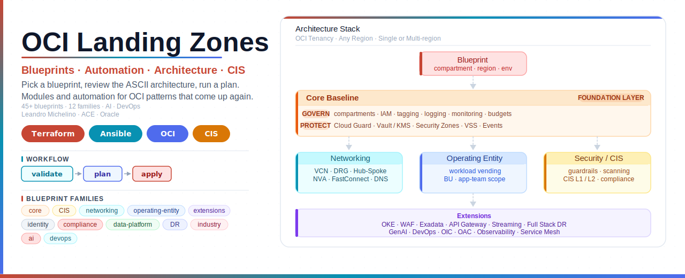

# OCI Landing Zones

Author: Leandro Michelino | ACE | leandro.michelino@oracle.com

This repo is a practical OCI landing-zone toolkit: Terraform modules, ready-to-use
blueprints, local Ansible automation, and plain-text architecture notes for the OCI patterns
that come up again and again.

It is meant to be useful in real work: clone it, pick a blueprint, review the ASCII
architecture, run a plan, and adapt the inputs to your tenancy. It is a personal engineering
project, not an official Oracle product, so treat it as a solid accelerator that you still
review, test, and harden before production.

## Start Here

The fastest path is simple: pick a deployment, open that folder, review the local
architecture, then run a plan. Everything important for a deployment lives in that
deployment folder.

| I Want To... | Go Here |
|---|---|
| Pick the right deployment folder | [Choose A Deployment](#choose-a-deployment) |
| Download only one deployment, not the whole repo | [Use One Blueprint Only](docs/DEPLOYMENT-GUIDE.md#using-a-single-blueprint) |
| Compare deployment families | [Deployment Categories](#deployment-categories) |
| See every blueprint with direct links | [Deployment Menu](#deployment-menu) |
| Build a complete landing zone | [Build A Full Landing Zone](#build-a-full-landing-zone) |
| Understand the folder contract | [Every Blueprint Is End-To-End](#every-blueprint-is-end-to-end) |

## Customer Flow

| Step | What To Do | Where |
|---|---|
| 1 | Choose the deployment that matches the outcome. | [Choose A Deployment](#choose-a-deployment) |
| 2 | For one deployment only, sparse-checkout just that blueprint folder. | `docs/DEPLOYMENT-GUIDE.md#using-a-single-blueprint` |
| 3 | Open the deployment folder and read its local guide. | `blueprints/<family>/<deployment>/README.md` |
| 4 | Review the detailed ASCII component and traffic-flow diagram. | `blueprints/<family>/<deployment>/architecture/README.md` |
| 5 | Copy the example tfvars, fill in real tenancy values, and run a plan from that folder. | local `terraform` or optional `ansible/plan.yml` |
| 6 | Apply only after review and approval. | guarded `ansible/apply.yml` or reviewed Terraform apply |

## Choose A Deployment

Start with the outcome, then open the linked folder. Each folder has its own README,
architecture, Terraform files, example tfvars, and local Ansible runners.

| Situation | Best Starting Point | Why |
|---|---|---|
| I need the landing-zone baseline first | [Core Landing Zone](blueprints/core/) | Creates the shared compartments, IAM, governance, logging, security, and operations layer. |
| I need a fast VCN example | [Standalone Three-Tier VCN Defaults](blueprints/networking/standalone-three-tier-vcn-defaults/) | Simple web/app/db network with opinionated defaults. |
| I need custom networking | [Standalone Three-Tier VCN Custom](blueprints/networking/standalone-three-tier-vcn-custom/) | Lets you control CIDRs, gateways, route tables, subnets, and security lists. |
| I need enterprise routing | [Hub-Spoke DRG And Three-Tier VCNs](blueprints/networking/hub-spoke-with-drg-and-three-tier-vcns/) | Central hub, DRG, and spoke VCNs for shared connectivity. |
| I need private service access only | [Standalone Private Endpoint Only](blueprints/networking/standalone-private-endpoint-only/) | Keeps traffic private with service gateway and private endpoint patterns. |
| I need regulated posture | [CIS Level 1](blueprints/cis/level1/) or [CIS Level 2](blueprints/cis/level2/) | Uses the core landing zone with CIS-specific posture. |
| I need app-team onboarding | [Workload Vending](blueprints/operating-entity/workload-vending/) | Creates a workload compartment boundary with scoped IAM. |
| I need Kubernetes | [OKE Extension](blueprints/extensions/oke/) | Adds an OKE cluster and optional node pool to supplied network IDs. |
| I need private GenAI | [OCI Generative AI Private Landing Zone](blueprints/ai/genai-private/) | Adds a private GenAI endpoint, optional archive bucket, and IAM policy shell. |
| I need CI/CD | [OCI DevOps Pipeline](blueprints/devops/oci-devops-pipeline/) | Adds DevOps project, repository, build pipeline, deploy pipeline, and notifications. |
| I need analytics or integration services | [Oracle Analytics Cloud](blueprints/extensions/oac/) or [Oracle Integration Cloud](blueprints/extensions/oic/) | Adds OAC or OIC service foundations with private connectivity options. |
| I need a private data platform | [Private Data Platform](blueprints/data-platform/private-data-platform/) | Builds private VCN, Vault/KMS, Object Storage private endpoint, and Streaming. |
| I need Autonomous Database | [Autonomous Database](blueprints/data-platform/autonomous-database/) | Adds private ATP/ADW with optional KMS, NSG, private endpoint, and backup controls. |
| I need disaster recovery | [Full Stack DR](blueprints/disaster-recovery/fsdr/) | Creates FSDR protection groups, log buckets, and an optional DR plan. |

## Deployment Categories

Use this when you know the family, but not the exact blueprint yet.

| Category | Start Here | Then Look At |
|---|---|---|
| Foundation and compliance | [Core Landing Zone](blueprints/core/) | [Foundation And Compliance](#foundation-and-compliance) |
| Networking | [Hub-Spoke DRG And Three-Tier VCNs](blueprints/networking/hub-spoke-with-drg-and-three-tier-vcns/) | [Networking Deployments](#networking-deployments) |
| Identity and entity onboarding | [Workload Vending](blueprints/operating-entity/workload-vending/) | [Identity And Operating Entity Deployments](#identity-and-operating-entity-deployments) |
| Service extensions | [OKE](blueprints/extensions/oke/) | [Extension Deployments](#extension-deployments) |
| AI and DevOps | [OCI Generative AI Private Landing Zone](blueprints/ai/genai-private/) | [AI And DevOps Deployments](#ai-and-devops-deployments) |
| Data, DR, and industry | [Private Data Platform](blueprints/data-platform/private-data-platform/) | [Data, DR, And Industry Deployments](#data-dr-and-industry-deployments) |

## Deployment Menu

Each link below goes directly to the deployment folder.

```text
open folder -> read README.md -> review architecture/README.md -> fill tfvars -> plan
```

### Foundation And Compliance

| Deployment | Use It When |
|---|---|
| [Core Landing Zone](blueprints/core/) | You want the shared OCI foundation: compartments, IAM, tags, logging, Cloud Guard, Vault/KMS, Security Zones, VSS, budgets, events, and monitoring. |
| [CIS Level 1](blueprints/cis/level1/) | You want the core foundation with CIS Level 1-oriented defaults and review posture. |
| [CIS Level 2](blueprints/cis/level2/) | You want a stricter CIS-oriented baseline with stronger evidence and guardrail expectations. |
| [SCCA Cloud Native](blueprints/compliance/scca-cloud-native/) | You need core governance, firewall-centered hub-spoke networking, and OS management for SCCA-style environments. |
| [Zero Trust](blueprints/compliance/zero-trust/) | You need core governance plus a three-tier VCN protected by Zero Trust Packet Routing. |
| [Healthcare PCI Compliance](blueprints/compliance/healthcare-pci/) | You need regulated workload guardrails, budget alerts, and optional Data Safe target registration. |

### Networking Deployments

| Deployment | Use It When |
|---|---|
| [Standalone Three-Tier VCN Defaults](blueprints/networking/standalone-three-tier-vcn-defaults/) | You want a clean web/app/db VCN with default gateways and route behavior. |
| [Standalone Three-Tier VCN Custom](blueprints/networking/standalone-three-tier-vcn-custom/) | You need to control CIDRs, subnets, route tables, gateways, and security lists. |
| [Standalone Private Endpoint Only](blueprints/networking/standalone-private-endpoint-only/) | You want private-only service access without an Internet Gateway. |
| [Standalone Three-Tier VCN ZPR](blueprints/networking/standalone-three-tier-vcn-zpr/) | You want a standalone web/app/db VCN with Zero Trust Packet Routing policies. |
| [Externally Managed VCNs](blueprints/networking/externally-managed-vcns/) | You already have VCNs/subnets/DRGs and want a clean output contract for brownfield resources. |
| [Hub-Spoke DRG And Three-Tier VCNs](blueprints/networking/hub-spoke-with-drg-and-three-tier-vcns/) | You need a central hub VCN, DRG, and spoke VCNs for enterprise routing. |
| [Hub-Spoke Dual Region DR](blueprints/networking/hub-spoke-with-dual-region-dr/) | You need matching hub-spoke foundations in primary and secondary regions. |
| [Hub-Spoke Bastion Jump Host](blueprints/networking/hub-spoke-with-hub-vcn-bastion-jump-host/) | You need managed private admin access through OCI Bastion. |
| [Hub-Spoke FastConnect VC](blueprints/networking/hub-spoke-with-hub-vcn-fastconnect-vc/) | You need private on-premises or provider connectivity through FastConnect. |
| [Hub-Spoke IPSec VPN](blueprints/networking/hub-spoke-with-hub-vcn-ipsec-vpn/) | You need encrypted VPN connectivity to on-premises networks. |
| [Hub-Spoke Network Appliance](blueprints/networking/hub-spoke-with-hub-vcn-net-appliance/) | You need custom appliance route targets inside the hub network. |
| [Hub-Spoke OCI Network Firewall](blueprints/networking/hub-spoke-with-hub-vcn-net-firewall/) | You need centralized firewall inspection in the hub VCN. |
| [Hub-Spoke Multicloud Interconnect](blueprints/networking/hub-spoke-with-multicloud-interconnect/) | You need FastConnect plus IPSec paths toward another cloud or remote network. |
| [Hub-Spoke Private DNS Split Horizon](blueprints/networking/hub-spoke-with-private-dns-split-horizon/) | You need private DNS zones and resolver attachments across hub and spokes. |
| [Hub-Spoke Transit Routing NVA HA](blueprints/networking/hub-spoke-with-transit-routing-nva-ha/) | You need highly available network virtual appliances for transit routing. |
| [Hub-Spoke ZPR Micro-Segmentation](blueprints/networking/hub-spoke-with-zpr-micro-segmentation/) | You need ZPR policies layered on a hub-spoke network. |
| [Multi-Tenancy Shared Services](blueprints/networking/multi-tenancy-shared-services/) | You need shared services and private DNS across multiple tenant/workload spokes. |
| [Regional Prod Nonprod Hubs](blueprints/networking/regional-prod-nonprod-hubs/) | You need separate prod and nonprod hub-spoke networks in one region. |

### Identity And Operating Entity Deployments

| Deployment | Use It When |
|---|---|
| [CIS Basic Identity](blueprints/identity/cis-basic/) | You need baseline IAM groups, dynamic groups, and policies. |
| [New Identity Domain](blueprints/identity/new-identity-domain/) | You need one OCI IAM identity domain with optional replica regions. |
| [Custom Identity Domains](blueprints/identity/custom-identity-domain/) | You need multiple identity domains from a structured input map. |
| [Single Operating Entity](blueprints/operating-entity/) | You need one business unit or operating entity compartment tree with scoped IAM. |
| [Multi Operating Entities](blueprints/operating-entity/multi-operating-entities/) | You need several operating entity boundaries from one deployment. |
| [Workload Vending](blueprints/operating-entity/workload-vending/) | You need repeatable app or workload onboarding with compartments and scoped policies. |

### Extension Deployments

| Deployment | Use It When |
|---|---|
| [API Gateway](blueprints/extensions/apigw/) | You need managed API exposure and route deployment on top of an existing network. |
| [Exadata](blueprints/extensions/exadata/) | You need OCI Cloud Exadata Infrastructure capacity. |
| [OKE](blueprints/extensions/oke/) | You need Kubernetes cluster and node pool resources attached to supplied VCN/subnets. |
| [OKE Service Mesh](blueprints/extensions/oke-service-mesh/) | You need service mesh add-on management and optional APM tracing for an existing OKE cluster. |
| [Oracle Analytics Cloud](blueprints/extensions/oac/) | You need private analytics capacity and private access channel wiring. |
| [Oracle Integration Cloud](blueprints/extensions/oic/) | You need OIC service capacity with optional private outbound connectivity. |
| [Observability](blueprints/extensions/observability/) | You need Log Analytics, APM, and Operations Insights private endpoint foundations. |
| [Streaming](blueprints/extensions/streaming/) | You need stream pools and streams, optionally with KMS and private endpoints. |
| [WAF](blueprints/extensions/waf/) | You need WAF policy and Web App Firewall attachment for an existing load balancer. |

### AI And DevOps Deployments

| Deployment | Use It When |
|---|---|
| [OCI Generative AI Private Landing Zone](blueprints/ai/genai-private/) | You need private OCI Generative AI access with archive and IAM controls. |
| [OCI DevOps Pipeline](blueprints/devops/oci-devops-pipeline/) | You need native OCI CI/CD with project, repository, build pipeline, deploy pipeline, and notifications. |

### Data, DR, And Industry Deployments

| Deployment | Use It When |
|---|---|
| [Autonomous Database](blueprints/data-platform/autonomous-database/) | You need private ATP or ADW with optional backup, KMS, NSG, and private endpoint controls. |
| [Private Data Platform](blueprints/data-platform/private-data-platform/) | You need private Object Storage access, Vault/KMS, and optional Streaming. |
| [Full Stack Disaster Recovery](blueprints/disaster-recovery/fsdr/) | You need FSDR protection groups, DR log buckets, and an optional DR plan. |
| [Telco Cloud Native](blueprints/industry/telco-cloud-native/) | You need hub-spoke networking, Vault, OKE, monitoring, and OS management for telco-style workloads. |

For a longer pattern-by-pattern catalog, see `docs/DEPLOYMENT-PATTERN-CATALOG.md`.

## Build A Full Landing Zone

For a fuller environment, deploy only what you actually need. A sensible order usually looks
like this:

| Step | Deployment |
|---|---|
| 1 | Bootstrap remote state, OCI CLI access, and tenancy prerequisites. |
| 2 | Deploy [Core](blueprints/core/) for the shared governance baseline. |
| 3 | Deploy one [Networking](#networking-deployments) blueprint for the traffic model. |
| 4 | Add [Operating Entity](#operating-entity-deployments) or workload vending patterns when ownership boundaries matter. |
| 5 | Add [Extensions](#extension-deployments) such as OKE, WAF, Exadata, API Gateway, or Streaming. |
| 6 | Run repo and security checks before merge or apply. |

The longer walkthrough lives in `docs/DEPLOYMENT-GUIDE.md`.

## What You Get

| Area | What Is Included |
|---|---|
| Core governance | Compartments, IAM, tagging, logging, monitoring, budgets, Cloud Guard, Vault/KMS, Security Zones, VSS, Events, and related controls. |
| Networking | Standalone VCNs, hub-spoke, DRG, VPN, FastConnect, DNS, firewall, network appliance, ZPR, multicloud, and regional patterns. |
| Operating model | Operating entity and workload vending patterns for team, business unit, or application ownership boundaries. |
| Extensions | Optional OKE, WAF, Exadata, API Gateway, and Streaming blueprints. |
| Compliance and industry | CIS, Zero Trust, SCCA-style, private data platform, FSDR, and telco cloud-native shapes. |
| Automation | Terraform for infrastructure and Ansible for local plan/apply/destroy orchestration. |
| Documentation | Each deployment has its own README, detailed ASCII architecture, and local TF + Ansible workflow notes. |

## Repo Map

```text
blueprints/          Deployable architectures. Pick from here when you want a working pattern.
modules/             Reusable Terraform building blocks used by the blueprints.
ansible/             Shared roles, inventories, checks, and Terraform orchestration.
docs/                Guides, catalog, runbooks, naming conventions, and standards.
docs/architecture/   Repository-level ASCII architecture index.
environments/        Example backend and tfvars shapes for dev, uat, and prod.
scripts/             Thin wrappers for repo checks and common local workflows.
tests/               Validation contract and future test location.
```

## Requirements

| Tool | Why You Need It |
|---|---|
| Terraform `1.12.0` or later | Builds and validates the OCI resource graph. |
| OCI CLI | Supplies local OCI authentication and tenancy context. |
| Git | Fetches the repo and pinned module sources. |
| Ansible | Runs repo checks and blueprint-local plan/apply/destroy workflows. |
| Optional scanners | `tflint`, `tfsec`, `checkov`, `ansible-lint`, and `pre-commit` are used when installed. |

The optional scanners are nice to have, not mandatory. The repo checks skip them cleanly
when they are not installed.

## How To Read A Deployment

Every deployment README now follows the same operator-friendly shape:

| Section | What You Should Get From It |
|---|---|
| At A Glance | The quick fit, Terraform shape, key decisions, and runner path. |
| What This Deploys | The actual modules, resources, or data sources wired in `main.tf`. |
| Inputs To Decide | Base tenancy inputs, deployment-specific choices, and enable flags. |
| Outputs And Hand-Off | The named values another blueprint, runbook, or customer note can consume. |
| Architecture | The local `architecture/README.md` with the detailed ASCII resource flow. |
| Review Before Apply | The short list to check before a real plan or apply. |

## Every Blueprint Is End-To-End

Each deployable blueprint folder has the same working shape:

```text
blueprints/<family>/<deployment>/
|-- README.md                  Human-friendly deployment notes
|-- architecture/
|   `-- README.md              Detailed, individual ASCII architecture
|-- main.tf                    Terraform composition for this deployment
|-- variables.tf               Input contract
|-- outputs.tf                 Named hand-off values
|-- providers.tf               OCI provider configuration
|-- versions.tf                Terraform/provider constraints
|-- terraform.tfvars.example   Local input example
`-- ansible/
    |-- plan.yml               Local init, validate, and plan
    |-- apply.yml              Guarded init, validate, plan, and apply
    `-- destroy.yml            Guarded destroy
```

This matters because every architecture is reviewable and runnable from its own folder. The
docs are not a shared generic diagram pasted everywhere; each architecture page reflects
that folder's Terraform components, request flow, trust boundaries, and local Ansible workflow.

## Architecture Experience

Every `architecture/README.md` is intentionally text-first. You should be able to review it
in GitHub, a terminal, a pull request, or customer notes without needing a diagramming tool.

Each architecture page includes:

| Section | Why It Is There |
|---|---|
| Deployment purpose | Plain-language reason this blueprint exists. |
| ASCII architecture | Detailed resource, boundary, and flow view in plain text. |
| Terraform components | Real modules/resources wired in `main.tf`. |
| Request and deployment flow | How operator intent moves into the Terraform resource graph. |
| Detailed architecture notes | Design-review detail for dependencies, traffic paths, ownership, and hand-offs. |
| Operational boundaries | Things to check before plan/apply/destroy. |
| Review checklist | What to inspect before trusting the deployment. |

## Terraform + Ansible Workflow

The usual local workflow is intentionally boring, which is exactly what you want for
infrastructure:

```text
review README.md
  |
  v
review architecture/README.md
  |
  v
copy terraform.tfvars.example -> terraform.tfvars
  |
  v
terraform init / validate / plan
  |
  v
ansible/plan.yml or guarded ansible/apply.yml
  |
  v
reviewed plan/apply result becomes the hand-off
```

Apply and destroy are guarded:

```bash
CONFIRM_APPLY=true ansible-playbook -i localhost, ansible/apply.yml
CONFIRM_DESTROY=true ansible-playbook -i localhost, ansible/destroy.yml
```

Each architecture page uses the space for deeper design notes instead of repeated state,
input, or output blocks, while the deployment README keeps the operator workflow close at hand.

## CIS Profiles

Generic blueprints do not turn on CIS behavior by default. If you need a CIS-aligned landing
zone, start from one of these folders:

```text
blueprints/cis/level1/
blueprints/cis/level2/
```

The current CIS contract lives in `docs/CIS-PROFILES.md`.

## Module Shape

Reusable modules try to keep a familiar interface where it makes sense:

```text
tenancy_ocid
compartment_ocid
region
org
environment
region_key
cis_level
defined_tags
freeform_tags
```

Modules should output stable identifiers such as OCIDs, names, and maps that blueprints can
compose. Remote state belongs to deployable blueprints, not shared modules.

## Useful Docs

| Doc | Use It For |
|---|---|
| `docs/ROADMAP.md` | Planned blueprints by phase: Autonomous DB, GenAI, DevOps, Observability, OIC, OAC, and more. |
| `docs/DEPLOYMENT-GUIDE.md` | Deployment sequence and operating notes. |
| `docs/DEPLOYMENT-PATTERN-CATALOG.md` | Blueprint catalog and selection notes. |
| `docs/architecture/README.md` | Repository-level ASCII architecture and documentation contract. |
| `docs/CIS-PROFILES.md` | CIS profile behavior. |
| `docs/ARCH-MAPPING-CIS.md` | CIS mapping notes. |
| `docs/NAMING-CONVENTIONS.md` | Naming standard. |
| `docs/RUNBOOK.md` | Operational runbook. |

## Keep The Repo Clean

Generated Terraform and local test files are intentionally ignored:

```text
.terraform/
.terraform.lock.hcl
terraform.tfstate*
tfplan
tfplan.*
*.tfplan
terraform.tfvars
.codex-local/
.claude/
```

For manual cleanup:

```bash
find . -name ".terraform" -type d -prune -exec rm -rf {} +
find . -name ".terraform.lock.hcl" -type f -delete
find . -name "terraform.tfstate*" -type f -delete
find . -name "tfplan*" -type f -delete
find . -name ".DS_Store" -type f -delete
rm -rf .codex-local
rm -rf .claude
```

## Maintainer Notes

Blueprint module sources are pinned to release tags such as `v0.2.0`. When a new release is
cut, update blueprint source refs deliberately in the same tagged commit. Avoid `?ref=main`
for customer-facing architecture folders because it can change module behavior without
review.

## License

This project is licensed under the Apache License 2.0. See `LICENSE` for details.
