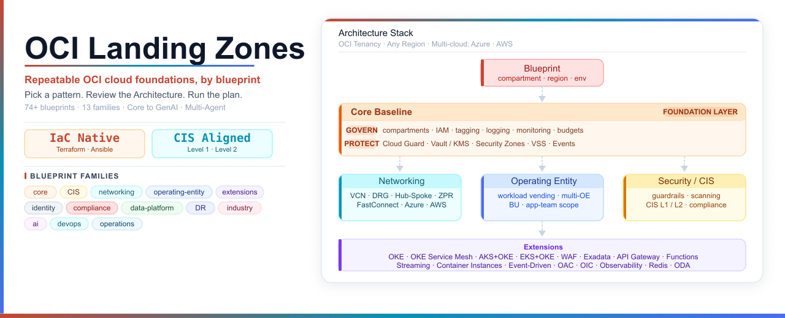

# OCI Landing Zones

[](LICENSE)


Author: Leandro Michelino | ACE | leandro.michelino@oracle.com

Build OCI landing zones fast, with clear architecture and real deploy flows.

This repo is a practical toolkit: Terraform blueprints, reusable modules, and
local Ansible wrappers for plan/apply/destroy sessions. It is opinionated,
reviewable, and built for real platform work. The thinking is intentionally
plain: pick the customer outcome, inspect the architecture, run the plan, then
make the deployment yours.

## Heads-Up

This is a personal engineering project, not an official Oracle product or
Oracle-supported package. Use it as a strong starting point, then tune it to
your tenancy, controls, and operating model.

## Start Here (2 Minutes)

```text
pick a blueprint -> read README -> review Architecture -> fill tfvars -> plan
```

```bash
git clone https://github.com/leandro-michelino/oci-landingzones.git
cd oci-landingzones/blueprints/core
cp terraform.tfvars.example terraform.tfvars
terraform init -backend=false
terraform validate
terraform plan
```

## What You Can Deploy

| If you need... | Start here |
|---|---|
| A full OCI baseline | [Core Landing Zone](blueprints/core/) |
| CIS controls | [CIS Level 1](blueprints/cis/level1/) or [CIS Level 2](blueprints/cis/level2/) |
| Kubernetes platform | [OKE Extension](blueprints/extensions/oke/) |
| Network inspection with FortiGate HA | [Hub-Spoke With FortiGate HA](blueprints/networking/hub-spoke-with-fortigate-ha/) |
| DR pattern | [Full Stack DR](blueprints/disaster-recovery/fsdr/) |
| Data platform foundations | [Autonomous DB](blueprints/data-platform/autonomous-database/), [PostgreSQL](blueprints/data-platform/postgresql/), [MySQL HeatWave](blueprints/data-platform/mysql-heatwave/), [OCI NoSQL](blueprints/data-platform/nosql/), [OCI + AWS MySQL HeatWave DR](blueprints/data-platform/oci-aws-mysql-heatwave-dr/) |
| AI workloads | [GenAI Private](blueprints/ai/genai-private/), [GenAI Gateway](blueprints/ai/genai-gateway/), [AI Agents](blueprints/ai/agents/) |
| Conversational AI | [Oracle Digital Assistant](blueprints/extensions/digital-assistant/) |

Full inventory:
- [Blueprint Index](BLUEPRINTS.md)
- [Deployment Pattern Catalog](docs/DEPLOYMENT-PATTERN-CATALOG.md)
- [Architecture Index](docs/architecture/README.md)

## Multicloud (OCI Primary)

### Azure + OCI (Available)

| Pattern | Blueprint |
|---|---|
| AI gateway routing by region, cost, or residency | [Azure + OCI AI Gateway](blueprints/ai/azure-oci-ai-gateway/) |
| Active/active Kubernetes (OCI-primary OKE, AKS secondary) | [AKS + OKE Active Active](blueprints/extensions/aks-oke-active-active/) |
| Cross-cloud DR (OCI primary, Azure standby) | [Azure + OCI Cross-Cloud DR](blueprints/disaster-recovery/azure-oci-cross-cloud-dr/) |
| Dual connectivity hardening (OCI DRG primary, Interconnect default when present + IPSec/BGP backup, testable without Interconnect) | [Azure + OCI Dual Connectivity Hardening](blueprints/networking/azure-oci-dual-connectivity/) |
| vWAN transit backbone (OCI DRG primary, vWAN/vHub route domain, Interconnect default when present, IPSec-first test mode) | [Azure vWAN + OCI DRG Transit](blueprints/networking/azure-vwan-oci-drg-transit/) |

### AWS + OCI (Available)

| Pattern | Blueprint |
|---|---|
| Hybrid backbone (OCI DRG primary) | [AWS + OCI Hybrid Network Backbone](blueprints/networking/aws-oci-hybrid-network-backbone/) |
| Cross-cloud DR (OCI primary, AWS standby) | [AWS + OCI Cross-Cloud DR](blueprints/disaster-recovery/aws-oci-cross-cloud-dr/) |
| Active/active Kubernetes (OCI-primary OKE, EKS secondary) | [EKS + OKE Active Active](blueprints/extensions/eks-oke-active-active/) |
| MySQL DR over IPSec (OCI primary) | [OCI + AWS MySQL HeatWave DR](blueprints/data-platform/oci-aws-mysql-heatwave-dr/) |

AWS deployment quick paths:
- Plan only:
  `ansible-playbook -i localhost, blueprints/networking/aws-oci-hybrid-network-backbone/ansible/aws-plan.yml`
- Full lifecycle (create + delete for test):
  `scripts/test-networking-lifecycle.sh --blueprint blueprints/networking/aws-oci-hybrid-network-backbone --providers aws`

All Azure+OCI and AWS+OCI blueprints include:
- deployable cloud-side sessions (`azure-*.yml` or `aws-*.yml`)
- local `hello-world/index.html`
- `ansible/serve-hello-world.yml` and `ansible/stop-hello-world.yml`

Design notes and backlog:
- [Multicloud Notes](docs/multicloud/README.md)

## Repo Structure

```text
blueprints/<family>/<deployment>/
|-- README.md
|-- architecture/README.md
|-- main.tf
|-- variables.tf
|-- outputs.tf
|-- providers.tf
|-- versions.tf
|-- terraform.tfvars.example
`-- ansible/
    |-- plan.yml
    |-- apply.yml
    `-- destroy.yml
```

Consistency is deliberate: once you know one blueprint, you can work in all of
them.

## Typical Operator Flow

```text
choose outcome
  |
  v
open blueprint folder
  |
  v
read README + Architecture
  |
  v
copy tfvars example
  |
  v
terraform plan or ansible/plan.yml
  |
  v
review and apply
```

## Local Workflow Options

Terraform direct:

```bash
terraform init -backend=false
terraform validate
terraform plan
```

Ansible wrapper:

```bash
ansible-playbook -i localhost, ansible/plan.yml
CONFIRM_APPLY=true ansible-playbook -i localhost, ansible/apply.yml
CONFIRM_DESTROY=true ansible-playbook -i localhost, ansible/destroy.yml
```

Cloud-specific wrappers in multicloud blueprints:
- Azure: `ansible/azure-plan.yml`, `ansible/azure-apply.yml`, `ansible/azure-destroy.yml`
- AWS: `ansible/aws-plan.yml`, `ansible/aws-apply.yml`, `ansible/aws-destroy.yml`

Cloud wrapper simulation:

```bash
make simulate-cloud
```

This checks every Azure and AWS wrapper, verifies its template and parameter
files, and exits before any vendor CLI call. Real Azure what-if and AWS
CloudFormation plan sessions still require logged-in `az` or `aws` CLIs.

## Pick By Family

| Family | What it covers |
|---|---|
| [core](blueprints/core/) | Tenancy foundation (IAM, tagging, logging, security, budgets, monitoring). |
| [cis](blueprints/cis/) | CIS-aligned baseline profiles. |
| [networking](blueprints/networking/) | VCN, DRG, DNS, firewall, hub-spoke, and multicloud connectivity patterns. |
| [identity](blueprints/identity/) | IAM group/policy and identity domain baselines. |
| [operating-entity](blueprints/operating-entity/) | Ownership and delegated administration boundaries. |
| [operations](blueprints/operations/) | Cost controls and FinOps guardrails. |
| [extensions](blueprints/extensions/) | OKE, Functions, API Gateway, WAF, ODA, Redis, Observability, and more. |
| [ai](blueprints/ai/) | GenAI, agents, embedding pipelines, guardrails, and gateway patterns. |
| [data-platform](blueprints/data-platform/) | Database and data platform patterns. |
| [compliance](blueprints/compliance/) | SCCA, Zero Trust, Healthcare/PCI, and security posture automation. |
| [disaster-recovery](blueprints/disaster-recovery/) | OCI and multicloud DR patterns. |
| [devops](blueprints/devops/) | OCI DevOps CI/CD foundation. |
| [industry](blueprints/industry/) | Vertical patterns (telco, secure desktops). |

## Quality Checks

Run checks for changed work:

```bash
./scripts/validate-changed.sh
```

Run checks for the full repository:

```bash
./scripts/validate-all.sh
```

Simulate Azure and AWS deployment wrappers without creating resources:

```bash
./scripts/simulate-cloud-deployments.sh
```

Performance tips:
- Shared Terraform provider cache is enabled by default with `TF_PLUGIN_CACHE_DIR`.
- Validation keeps local `.terraform` workdirs by default for faster reruns.
- Force full cleanup when needed:
  `VALIDATION_CLEAN_TERRAFORM_WORKDIRS=1 ./scripts/validate-all.sh`

Networking lifecycle tests (create then destroy):
- `scripts/test-networking-lifecycle.sh --blueprint blueprints/networking/aws-oci-hybrid-network-backbone --providers oci,aws`
- `scripts/test-networking-lifecycle.sh --all-networking --providers oci` (heavy run)

Maintainer-focused validation details live in [CONTRIBUTING.md](CONTRIBUTING.md).

## Contributing

- Read [CONTRIBUTING.md](CONTRIBUTING.md)
- Keep module sources pinned
- Keep every blueprint deployable and reviewable
- Keep Architecture docs aligned with Terraform

Issues and PRs work best when they describe the customer outcome, the operating
constraints, and the blueprint shape you want to land.
